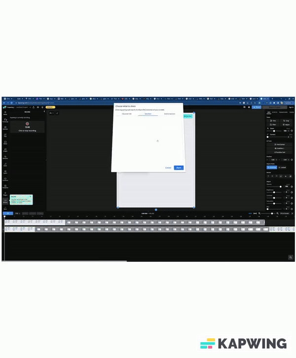

<h1>APIs for Event Shuffle</h1>

<b>Operations</b>

<ul>
  <li>Create an Event</li>
  <li>Get the info about all the events</li>
  <li>Get the info on a specific event</li>
  <li>Add dates Selection to a specific event</li>
  <li>Get results of the suitable as per the votes for dates on a specific events</li>
</ul>

<h2>Demonstration</h2>


<h2>Development Setup Scripts</h2>
```
npm install
```

```
npm run start
```

<h2>Prod Setup Scripts </h2>
```
npm run build
```

```
npm run start-prod
```

<h2>Development Folder Structure</h2>

```
root
  |-> client ( UI Logic using React & Vite )
  |-> controllers ( API Logic & connection to DB )
  |-> db-utils
      |-> mongodb-connnection.ts ( db connection logic )
  |-> routes
      |-> events.ts ( mapping the controller logics with corresponding route )
  |-> schema
      |-> models.ts ( all the schema/models required )
      |-> types.ts ( interfaces )
  |-> server.ts ( Server app initialization, db connection, middleware & server startup)
```
